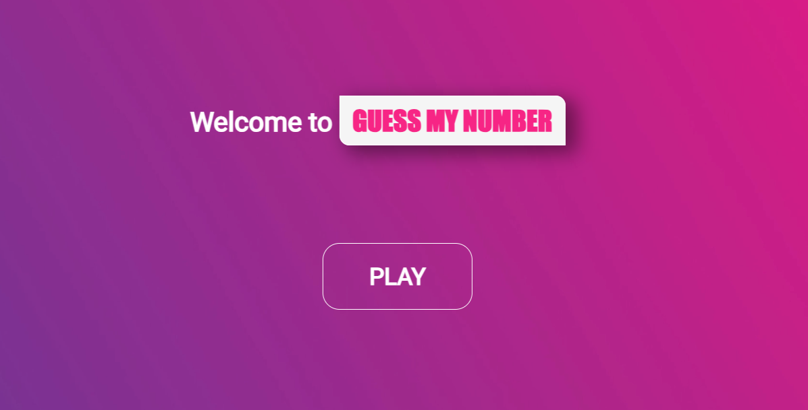
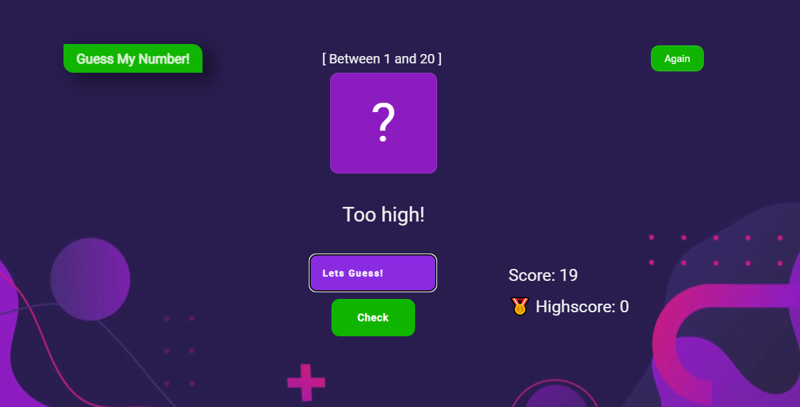
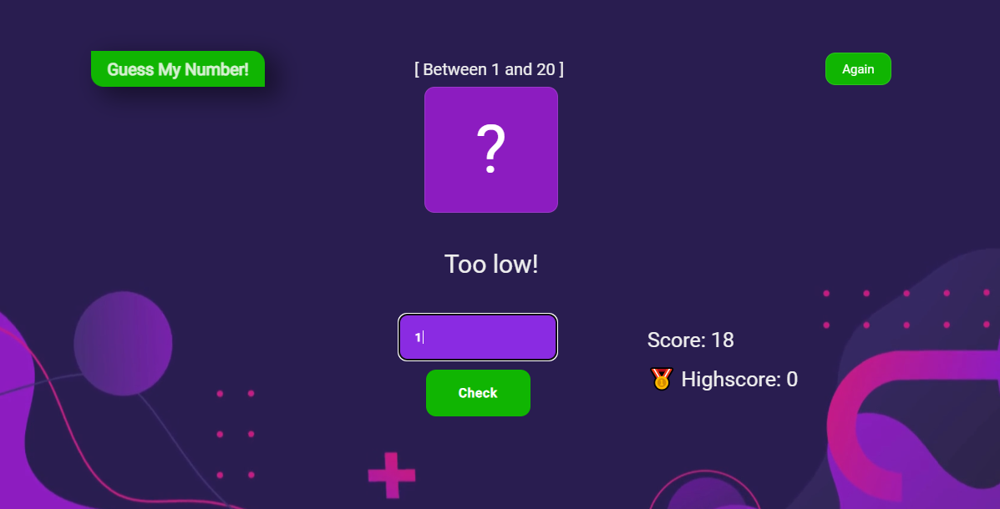
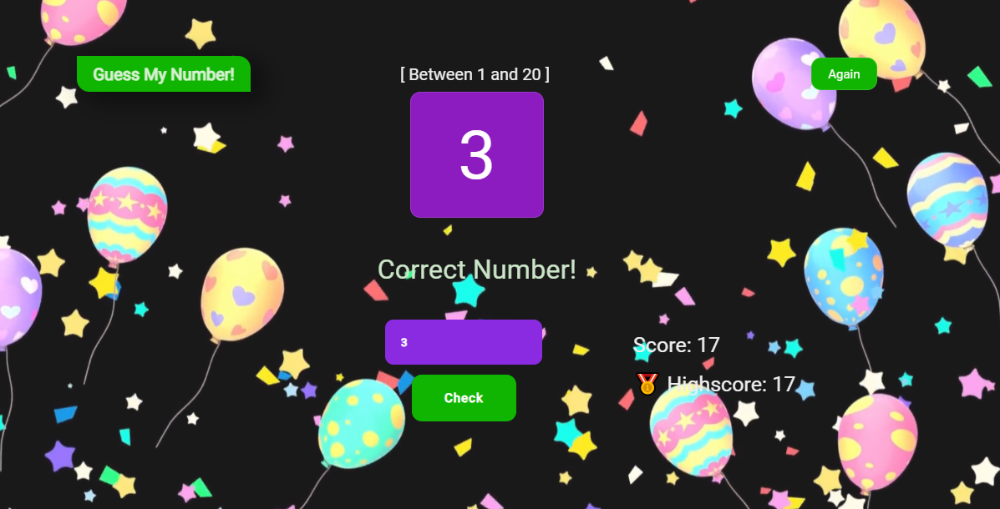
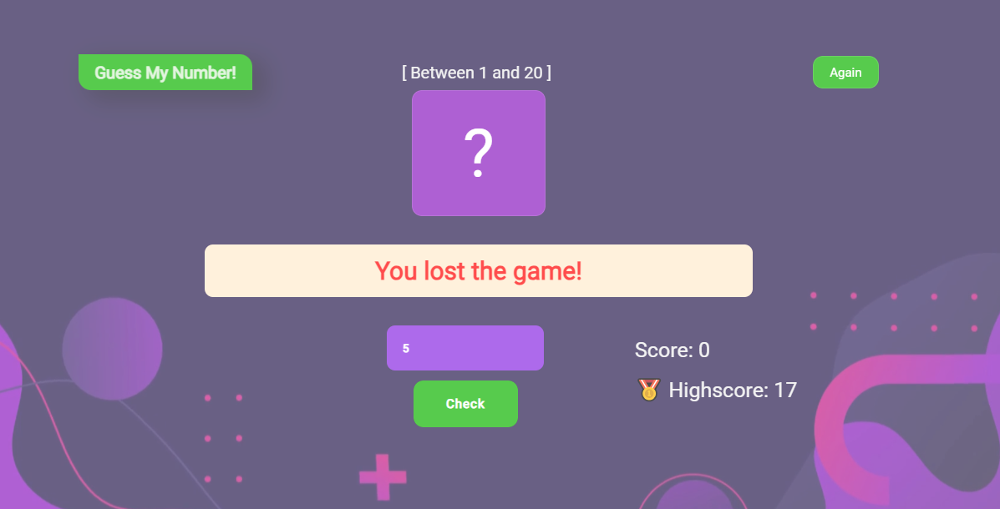

# 
<h1 align="center"> GUESS_MY_NUMBER </h1>
<h2>Hakkında:</h2>

<h2>Live: 👉https://guess-my-numbergame.vercel.app/</h2>

<h1>The rules of this game created with a module structure:</h1>
<ul>
  <li>When the game starts, a random number between 1-20 is determined. The player starts guessing this number</li>
  <li>The initial score is 20 points. And at the end of each wrong guess, 1 is decreased.</li>
  <li>If the score reaches 0, the player loses the guessing game.</li>
  <li>If the number the player guesses is less than the answer, a "To Low" message appears on the screen; If it is larger, the message "To High" appears on the screen.</li>
  <li>If it is guessed correctly, the "Correct Number" message appears on the screen. And thanks to the observer structure, a video with a celebration effect appears in the background.</li>
  <li>If the player wants to play the game again, he presses the "again" button and the last score when he wins is now equal to the highscore.</li>
</ul>

<h2> GÖRSELLER :</h2>

